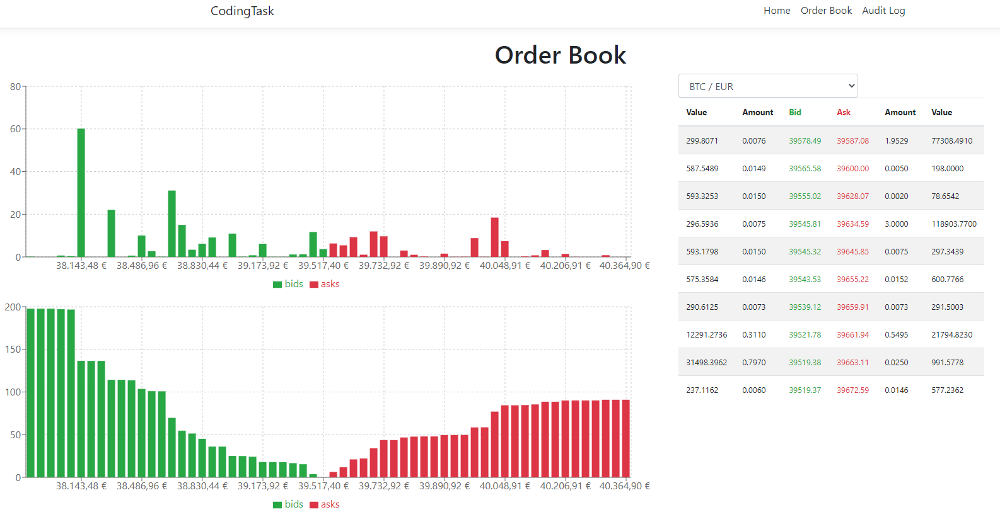
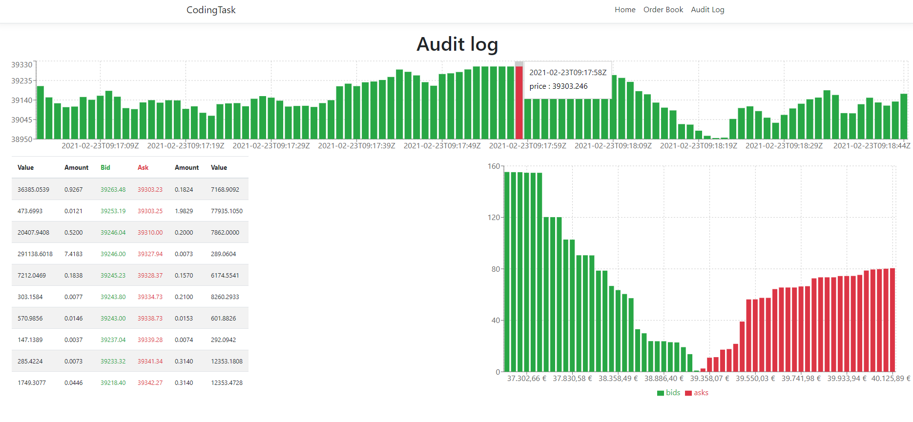

# Coding Task

BACKGROUND 

To understand the task, educate yourself about the order book (basic knowledge is more than enough). For simplicity, let's assume that we are dealing with a cryptoexchange that only offers Bitcoin (BTC), and that BTC can only be traded for EUR. See the attached PPT.
Imagine that you have a trading website and you would like to display the BTC/EUR order book in real time to the end user.

THE TASK

Display the BTC/EUR market depth chart to the end user on a simple website, you can get the data from Bitstamp or any other exchange. The back-end should be written in .NET, for the front-end you can choose any framework you wish or even do it without a framework.

To make our task a bit more challenging, you should keep an audit log of every order book that is [potentially] displayed to the end user with the timestamp of when it was acquired.

BONUS TASKS

* Write some tests for your code. 
* Show also the BTC/USD order book to the user.
OTHER NOTES
Please use GIT while developing the code. Keep it as simple as the nature of this problem allows it. Do not over-engineer. Be ready to explain / demonstrate your solution in our office (or in a remote chat).
May the force be with you.

UI

Order book

Audit log

